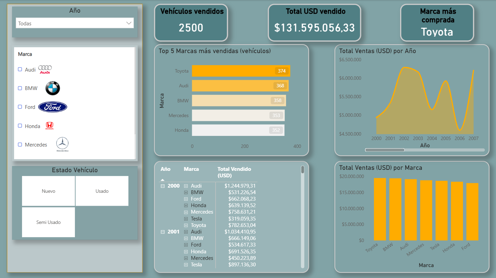
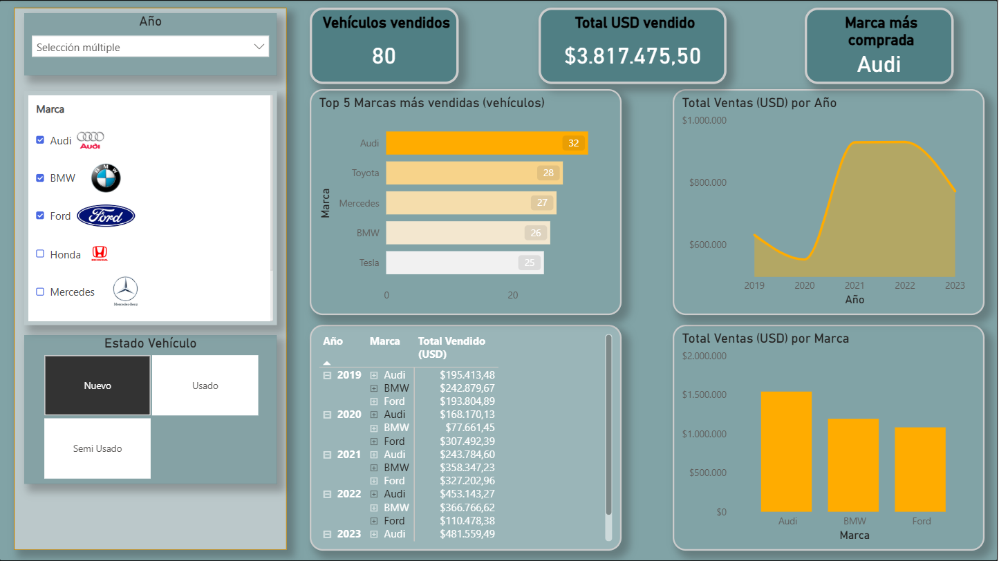

# Car Visualization (Power BI)

Dashboard interactivo en **Power BI Desktop** para analizar ventas de vehículos (a partir de registros) y explorar el desempeño por **marca/modelo**, tendencias y detalles con **tooltips**.

## Preview

## Habilidades clave

- Data modeling (relationships, star-schema thinking)
- DAX measures for KPIs
- Dashboard design (visual hierarchy, tooltips, slicers)

## Problema que resuelve

Este reporte responde preguntas típicas de negocio como:
 - **¿Cuál es la marca más vendida?** *(cuando no existe una columna “cantidad”, se usa conteo de registros como proxy de ventas)*
- ¿Cómo se distribuye el volumen por **marca** y **modelo**?
- ¿Cómo se comportan las métricas a lo largo del tiempo? (tendencias)
- ¿Qué detalles cambian cuando filtro por marca/modelo/segmento?

## Report pages
- **Página 1** — Dashboard principal (KPIs + tendencias + comparativos)
- **TT Modelos** — Página de **tooltip** (detalle por modelo al pasar el cursor)

## Key features

- **KPIs con DAX** (tarjetas) para métricas clave.
- **Tendencias** (líneas) y **comparativos/rankings** (barras/columnas).
- **Slicers / filtros** para segmentar el análisis.
- **Tooltip dedicado** (TT Modelos) para ver detalle contextual sin saturar el canvas.
- Enfoque en **diseño**: jerarquía visual, lectura rápida y consistencia de formato.

## Tech stack & skills demonstrated

- **Power BI Desktop**
- **Power Query**: limpieza básica, tipado y preparación de datos
- **Modelado**: relaciones y estructura pensada para análisis
- **DAX**: medidas para KPIs, rankings y lógica contextual
- **UX de reportes**: tooltips, segmentación y navegación por filtros

## Dataset
Kaggle URL: *https://www.kaggle.com/datasets/abubakrabubakr/car-price-prediction*

## Contact

- LinkedIn: *https://ec.linkedin.com/in/andre-israel-cedeno*
- Email: *andreisrael11@gmail.com*
